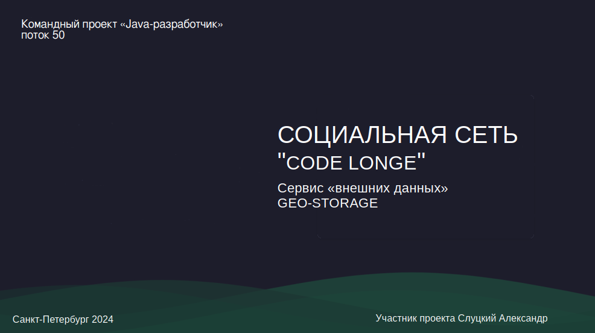
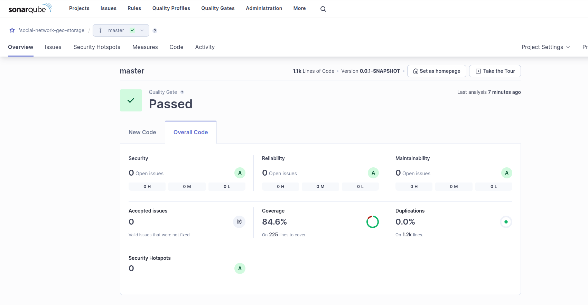

# <u> Микросервис social-network-geo-storage</u>

Микросервис social-network-geo-storage является частью командной разработки социальной сети"Social network Code Lounge".

Проект базируется на микросервисной архитектуре. Микросервис social-network-geo-storage решает задачи связи приложения с внешними источниками данных.

## Взаимодействие с сайтом "HeadHunter"

С сайта HeadHunter приложение получает "геоданные" - список стран и соответствующих этим странам городов. Для интеграции с API HeadHunter используется OpenFeign клиент. Данные получаются путем выполнения двух типов запросов: одн получает перечень стран, второй - по идентификатору страны получает структуру, содержащую информацию о регионах страны. Данные обрабатываются, преобразовываются в выходной формат, и передаются во фронтэнд для дальнейшего использования.

При обработке и преобразовании данных используются алгоритмы "обход в ширину", "хвостовая рекурсия".

Для хранения результатов ресурсоемкого запроса "геоданных" используется кэш на базе Redis.

## Хранение изображений пользователя в "холодном" облачном хранилище

"Холодное" Amazon S3 совместимое облачное хранилище Yandex Cloud используется для хранения пользовательских изображений (изображений аккаунта, изображений постов), а также служебных изображений (капч). Для взаимодействия с облачным хранилищем используется библиотека Amazon S3 Java SDK. С целью экономии места в облачном хранилище реализованы:
* Удаление изображений капч по расписанию средствами стандартного Spring планировщика (@Scheduled)
* Удаление пользовательских изображений из облака при удалении или замене соответствующего изображения пользователем
* Удаление всех изображений, относящихся к пользователю, при удалении профиля пользователя. Сообщение об удалении профиля пользователя из социальной сети передается в микросервис geo-storage из микросервиса управления аккаунтами передается через брокер сообщений Kafka

### Анализ качества кода

В процессе разработки выполнялся статический анализ качества кода средствами SonarQube. Результаты анализа финальной версии кода таковы:

